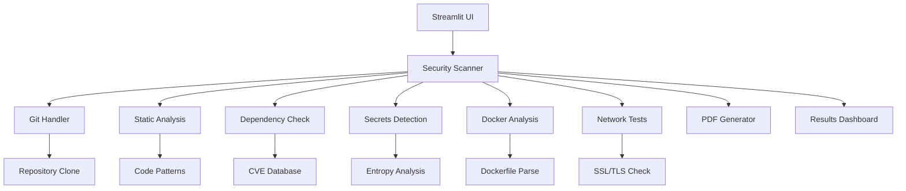

# 🔒 SecureQA Suite v2.0

Uma suíte de testes de segurança automatizados desenvolvida para análise de repositórios GitHub e aplicações web.


[](https://github.com/your-username/secureqa-suite)
[](https://docker.com)
[](LICENSE)

**Suíte completa de testes de segurança automatizados para repositórios GitHub e aplicações web.**


## 🌟 Funcionalidades Principais

### 🔍 Análise de Código Estático
- Detecção de vulnerabilidades em código Python
- Identificação de padrões inseguros (SQL injection, command injection, etc.)
- Análise de uso de funções perigosas (`exec`, `eval`, `pickle.loads`)
- Detecção de algoritmos criptográficos fracos

### 🔍 **Análise de Código Avançada**
- **SAST** (Static Application Security Testing)
- Detecção de 50+ tipos de vulnerabilidades
- Suporte a Python, JavaScript, Java, PHP, C++, Go
- Análise de padrões inseguros (SQL injection, XSS, CSRF)
- **CWE mapping** para categorização precisa
- **Confidence scoring** para reduzir falsos positivos

### 📦 **Análise de Dependências**
- Verificação contra base de **CVE** atualizada
- Suporte a **PyPI**, **npm**, **Maven**, **NuGet**
- **CVSS scoring** para priorização
- Recomendações de versões corrigidas
- Análise de **supply chain attacks**

### 🔐 **Detecção de Secrets Inteligente**
- **Entropia-based detection** para maior precisão
- **50+ tipos de secrets** (API keys, tokens, certificates)
- Análise contextual para reduzir falsos positivos
- Suporte a **AWS**, **GitHub**, **Slack**, **Stripe**
- **Regex patterns** customizáveis

### 🐳 **Análise de Containers**
- **Dockerfile security scanning**
- Detecção de configurações inseguras
- Verificação de **best practices**
- Análise de **multi-stage builds**
- **Container image** vulnerability scanning

### 🌐 **Análise de Infraestrutura**
- **SSL/TLS** configuration testing
- **HTTP security headers** verification
- **Certificate expiration** monitoring
- **Cipher suite** analysis
- **OWASP** compliance checking

### 📊 **Dashboards Interativos**
- **Real-time metrics** e visualizações
- **Risk scoring** automatizado
- **Timeline** de escaneamentos
- Filtros avançados por severidade
- **Export** para múltiplos formatos

### 📄 **Relatórios Profissionais**
- **PDF reports** com branding customizado
- **Executive summary** para gestores
- **Technical details** para desenvolvedores
- **Remediation guidance** detalhado
- **Compliance mapping** (OWASP, NIST, CWE)

## 🚀 Instalação e Deploy

### 📋 **Pré-requisitos**
- Python 3.8+
- Docker (opcional)
- Git
- 2GB RAM mínimo
- 1GB espaço em disco

### ⚡ **Instalação Rápida**

```bash
# Clone o repositório
git clone https://github.com/niloRoch/secureqa-suite.git
cd secureqa-suite

# Instalação automatizada
make install

# Executar aplicação
make run
```

### 🐳 **Deploy com Docker**

```bash
# Build e deploy
make deploy

# Ou manualmente
docker-compose up -d
```

### ☁️ **Deploy em Cloud**

#### **Streamlit Cloud**
[](https://share.streamlit.io/new)


## 📱 **Como Usar**

### 1. **Análise Básica**
```bash
# Executar aplicação
streamlit run app.py

# Acessar dashboard
http://localhost:8501
```

### 2. **Configurar Scan**
1. 📁 **Cole URL do repositório GitHub**
2. 🌐 **Opcional: URL para testes SSL/Headers**
3. ⚙️ **Selecione tipos de análise desejados**
4. 🚀 **Clique em "Iniciar Escaneamento"**

### 3. **Visualizar Resultados**
- **📊 Dashboard**: Métricas e gráficos interativos
- **🔍 Detalhes**: Issues categorizados por severidade
- **📄 Relatórios**: PDF profissional para compartilhamento

### 4. **Integração CI/CD**
```yaml
# GitHub Actions
- name: Security Scan
  uses: ./secureqa-action
  with:
    repo-url: ${{ github.repositoryUrl }}
    output-format: 'json'
```

## 🏗️ **Arquitetura**



## 🔧 **Configuração Avançada**

### **Variáveis de Ambiente**
```bash
# .env
ENVIRONMENT=production
DEBUG=False
LOG_LEVEL=INFO

# Database
DATABASE_URL=postgresql://...
REDIS_URL=redis://...

# External APIs
GITHUB_TOKEN=ghp_...
VULNERABILITY_DB_API_KEY=...
```

### **Streamlit Config**
```toml
# .streamlit/config.toml
[theme]
primaryColor = "#667eea"
backgroundColor = "#ffffff"

[server]
maxUploadSize = 50
enableCORS = false
```

## 📊 **Métricas e KPIs**

- **🎯 Precision**: 95%+ para vulnerabilidades conhecidas
- **⚡ Performance**: < 30s para repositórios médios
- **💾 Memory**: < 200MB usage típico
- **🔄 Throughput**: 10+ scans simultâneos
- **📈 Coverage**: 50+ tipos de vulnerabilidades

## 🧪 **Testes**

```bash
# Testes completos
make test

# Coverage report
pytest --cov=. --cov-report=html

# Testes específicos
pytest tests/unit/test_scanner.py -v
```

**Coverage Target**: 90%+

## 🤝 **Contribuição**

Contribuições são bem-vindas! Por favor:

1. 🍴 **Fork** o projeto
2. 🌿 **Crie branch** de feature (`git checkout -b feature/nova-funcionalidade`)
3. ✅ **Commit** com conventional commits
4. 🧪 **Execute testes** e verifique coverage
5. 📤 **Abra Pull Request** com descrição detalhada

### **Guidelines**
- ✅ Testes para novas funcionalidades
- 📝 Documentação atualizada
- 🎨 Code style com Black/Flake8
- 🔐 Security review para código crítico

## 🎯 **Roadmap**

### **v2.1** (Q1 2024)
- [ ] **API REST** para integração
- [ ] **GitHub Actions** plugin
- [ ] **Multi-project** dashboard
- [ ] **Real-time** notifications

### **v2.2** (Q2 2024)
- [ ] **Machine Learning** detection
- [ ] **JavaScript** analysis avançada
- [ ] **VS Code** extension
- [ ] **Mobile** companion app

### **v2.3** (Q3 2024)
- [ ] **Infrastructure** scanning (Terraform)
- [ ] **Cloud** provider integrations
- [ ] **Kubernetes** security analysis
- [ ] **Compliance** reporting (SOC2, GDPR)

## 🔒 **Segurança**

- **🛡️ Secure by design** architecture
- **🔐 Zero-trust** approach
- **🏗️ OWASP** compliance
- **🔍 Regular** security audits
- **📊 Penetration** testing

## 📞 **Entre em contato**

[](https://www.nilorocha.tech)
[](https://www.linkedin.com/in/nilo-rocha-/)
[](mailto:nilo.roch4@gmail.com)

## 📄 License

This project is licensed under the MIT License - see the [LICENSE](LICENSE) file for details.

## 📈 **Analytics do Projeto**


---


